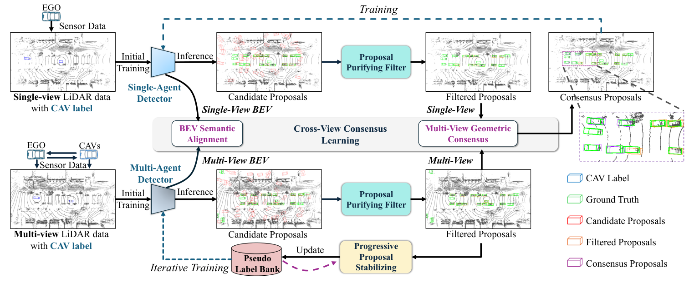

<div align="center">

# UMS

### Unsupervised Multi-agent and Single-agent Perception from Cooperative Views

**CVPR 2026**

[](https://arxiv.org/abs/2604.05354)
[](pyproject.toml)
[](pyproject.toml)
[](pyproject.toml)
[](LICENSE)

**Official implementation of “Unsupervised Multi-agent and Single-agent Perception from Cooperative Views”**

*Haochen Yang, Baolu Li, Lei Li, Delin Ren, Jiacheng Guo, Minghai Qin, Tianyun Zhang, Hongkai Yu*

[Paper](https://arxiv.org/abs/2604.05354) · [Setup](#environment-setup) · [Training](#training) · [Results](#paper-results) · [Citation](#citation)

</div>

---

## ✨ Overview

UMS learns multi-agent and single-agent 3D object detectors from cooperative LiDAR views without human-annotated 3D bounding boxes. It progressively purifies and stabilizes weak proposals, then transfers cooperative-view knowledge to single-agent perception.

<p align="center">
  
  <br>
  <em>Overview of the UMS framework.</em>
</p>

## 📅 TODO

- [x] Release the paper and initial codebase.
- [x] Release weak-detector training on OPV2V and V2V4Real.
- [ ] Release the complete UMS training and evaluation pipeline.
- [ ] Release pretrained checkpoints.

<a id="environment-setup"></a>

## ⚙️ Environment Setup

The code is tested with Python 3.9, CUDA 11.8, and PyTorch 2.0.1. After installing [uv](https://docs.astral.sh/uv/), create the environment with:

```bash
uv sync --locked
source .venv/bin/activate
```

Verify the installation:

```bash
python -c "import torch; print(torch.cuda.is_available())"
```

## 📦 Data Preparation

Download [OPV2V](https://github.com/DerrickXuNu/OpenCOOD) and [V2V4Real](https://github.com/ucla-mobility/V2V4Real), then organize them as follows:

```text
data/
├── opv2v/
│   ├── train/
│   └── test/
└── v2v4real/
    ├── train/
    └── test/
```

Set `root_dir` and `validate_dir` to your local paths in the corresponding files under `opencood/hypes_yaml/ums/`.

<a id="training"></a>

## 🚀 Training

> **Release status:** The current code provides the weak-detector initialization stage. The complete UMS pipeline will be released in a future update.

Weak detectors use communicated-agent (CAV) labels for training and standard test labels for evaluation.

### OPV2V

```bash
python opencood/tools/train.py \
  --hypes_yaml opencood/hypes_yaml/ums/opv2v/point_pillar_opv2v_cav_label_only.yaml
```

### V2V4Real

```bash
python opencood/tools/train.py \
  --hypes_yaml opencood/hypes_yaml/ums/v2v4real/point_pillar_v2v4real_cav_label_only.yaml
```

Each epoch reports AP, precision, and recall at IoU thresholds 0.3, 0.5, and 0.7. Outputs are saved under:

```text
results/<experiment>_<timestamp>/
├── config.yaml
├── checkpoints/
├── metrics/
├── tensorboard/
└── logs/train.log
```

## 🔍 Evaluation

The inference script automatically loads the latest checkpoint from an experiment directory:

```bash
python opencood/tools/inference.py \
  --model_dir results/<experiment>_<timestamp> \
  --fusion_method intermediate
```

Use `--save_vis` to save visualizations or `--save_npy` to export predictions and ground truth.

<a id="paper-results"></a>

## 📊 Paper Results

AP@0.3 / AP@0.5 on the real-world and simulated cooperative perception benchmarks:

| Method | V2V4Real Multi-agent | V2V4Real Single-agent | OPV2V Multi-agent | OPV2V Single-agent |
|---|---:|---:|---:|---:|
| Supervised | 71.35 / 64.75 | 57.40 / 50.17 | 94.80 / 94.11 | 80.01 / 77.89 |
| OYSTER | 37.50 / 23.52 | 29.08 / 24.25 | 56.58 / 49.01 | 42.62 / 41.93 |
| CPD | 40.67 / 30.27 | 37.41 / 30.28 | 59.17 / 50.49 | 44.27 / 43.25 |
| DOtA | 54.60 / 48.84 | 45.40 / 40.41 | 66.14 / 52.37 | 59.01 / 46.87 |
| **UMS** | **58.12 / 52.03** | **49.72 / 44.27** | **86.71 / 83.89** | **76.31 / 71.30** |

<a id="citation"></a>

## 📝 Citation

If you find this work useful, please consider citing:

```bibtex
@inproceedings{yang2026ums,
  title     = {Unsupervised Multi-agent and Single-agent Perception from Cooperative Views},
  author    = {Yang, Haochen and Li, Baolu and Li, Lei and Ren, Delin and Guo, Jiacheng and Qin, Minghai and Zhang, Tianyun and Yu, Hongkai},
  booktitle = {Proceedings of the IEEE/CVF Conference on Computer Vision and Pattern Recognition (CVPR)},
  year      = {2026}
}
```

## 🙏 Acknowledgements

This codebase is built upon [OpenCOOD](https://github.com/DerrickXuNu/OpenCOOD). We thank the authors of OpenCOOD, OPV2V, and V2V4Real for their excellent work.
